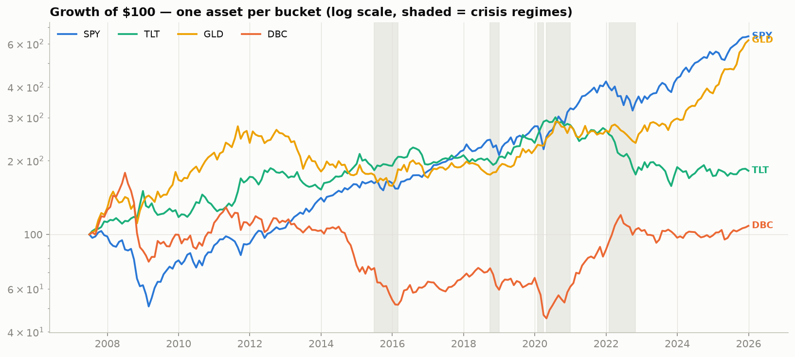
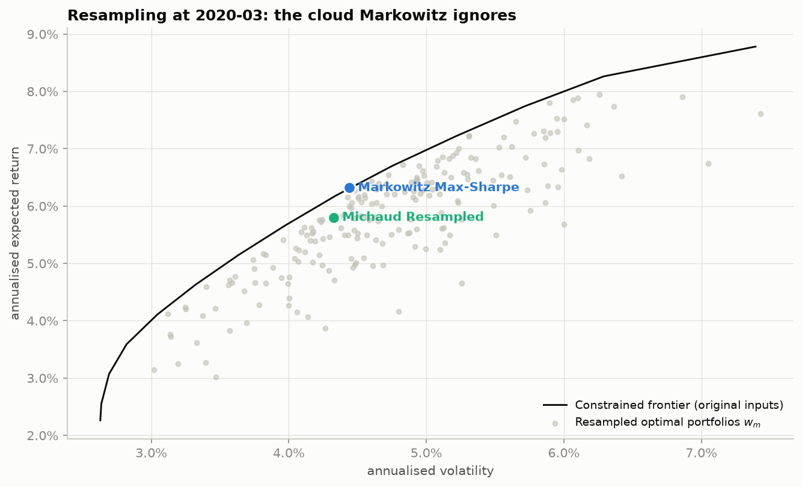
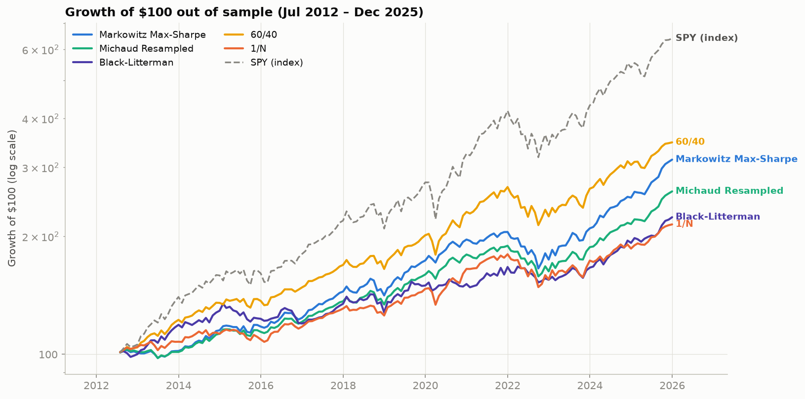
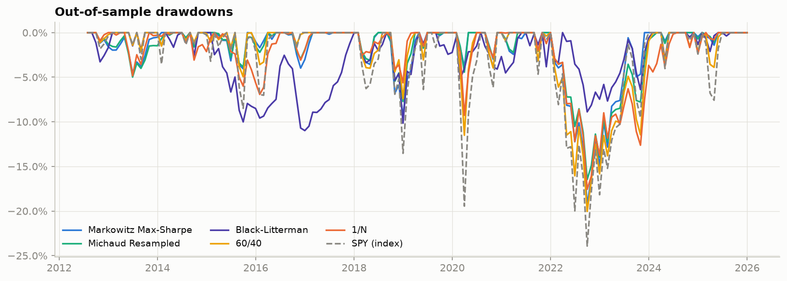
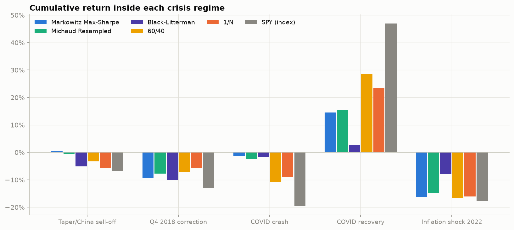

# Dynamic Asset Allocation — FMA 2025/26 Final Project (Variant B)

An out-of-sample comparison of three portfolio-construction methods on a
16-ETF multi-asset universe — classical **Markowitz mean–variance (max-Sharpe)**,
the **Michaud resampled efficient portfolio**, and **Black–Litterman** (the
optional extension, included) — benchmarked against a naive **60/40**, a **1/N**
equal-weight portfolio, and the **market index (SPY buy & hold)**.

Course: Financial Markets Analytics, Prof. G. Forte, A.Y. 2025/2026.

---

## 1. Motivation and research question

The core task is the out-of-sample comparison of the estimators and optimisers
above. On top of it we frame a **secondary research question** that gives the
project a narrative and, in particular, motivates the choice of the ETF universe:

> *Do the lessons of past crises carry over? Does robust dynamic asset
> allocation (Michaud, Black–Litterman) earn its value primarily in crisis and
> post-crisis regimes — and do "crisis hedge" assets (long Treasuries, gold,
> TIPS) deserve their place in the universe once estimation error is handled
> properly?*

The question is deliberately secondary: it does not replace the required
comparison, but it (i) drives an ETF universe built for heterogeneous crisis
behaviour, and (ii) leads us to evaluate performance **regime by regime**, not
only over the full sample.

---

## 2. Universe and data

### 2.1 The 16-ETF universe

Dynamic asset allocation is naturally a multi-asset problem, so rather than the
single-market stock lists provided (S&P 500 / STOXX 600) we build a broader ETF
universe. It covers **every asset class the assignment requires**, plus both
optional ones:

| Assignment-required category | Covered by | |
|---|---|---|
| Global equity — developed | SPY, IWM, QQQ (US), EFA (developed ex-US) | ✅ |
| Global equity — emerging *(optional)* | EEM | ✅ |
| Government bonds — short duration | SHY (1–3y) | ✅ |
| Government bonds — long duration | TLT (20y+), IEF (7–10y) | ✅ |
| Investment-grade **or** high-yield credit | LQD (IG) **and** HYG (HY) | ✅ |
| Commodities **and/or** gold | GLD (gold) **and** DBC (broad) | ✅ |
| Cash proxy | BIL (1–3m T-bills) | ✅ |
| Real estate — REIT *(optional)* | VNQ | ✅ |
| Inflation-linked bonds *(optional)* | TIP (TIPS) | ✅ |

16 ETFs, within the 15–30 range. AGG (US aggregate bond) is added as the bond
leg of the 60/40 benchmark. Each asset is chosen for a distinct crisis role:
flight-to-quality (Treasuries), inflation shocks (TIPS, commodities, gold),
credit stress (IG/HY spreads), real assets (REITs).

> **Note on two kinds of "category".** The table above is about *universe
> coverage*. Separately, the optimisation constraints group the assets into
> three coarse **macro-buckets** (`equity` / `bond` / `alternative`) purely to
> impose a 60%-per-bucket budget cap. The two groupings are consistent, not in
> conflict: coverage is fine-grained, the budget constraint is deliberately
> coarse.

### 2.2 Data source and sample

- **Source**: Yahoo Finance via `yfinance`, **adjusted close** prices (total
  return — splits and dividends reinvested). Chosen because it is free, exactly
  reproducible, and dividend-adjusted. Limitations discussed in nb 01: data
  quality must be checked (we document a cleaning step), and history is bounded
  by each ETF's inception (which sets the 2007 start). Survivorship bias is not
  a concern for index-tracking ETFs.
- **Risk-free rate**: 3-month T-bill (FRED series `TB3MS`), converted to monthly.
- **Sample**: monthly, **Jun 2007 – Dec 2025 (~18.5 years ≥ 15y minimum)**,
  covering three major crises: GFC 2008, COVID 2020, inflation shock 2022.
- **Documented cleaning** (nb 01): missing values forward-filled inside the
  month only (never across month-ends); the monthly panel starts when all 16
  ETFs trade (a common, non-changing universe); extreme returns are inspected,
  not deleted (crisis moves must stay in the sample); a QC table is saved to
  `data/processed/`. Final panel: 16 assets × 222 monthly returns, zero NaNs.

A sanity check on the descriptive statistics confirms the data is realistic:
SPY +10.6% p.a. with −50.8% max drawdown (GFC), TLT with a −47.6% drawdown (the
2022 bond crash), BIL cash-like, DBC roughly flat (the commodity "lost decade").



---

## 3. The three strategies

All subjective parameters live in `src/config.py` and are justified in nb 02:

| Choice | Value | Rationale |
|---|---|---|
| Estimation window | 60 months (36m sensitivity) | 60 obs > 16 assets → stable Σ, still adaptive |
| Rebalancing | monthly (quarterly sensitivity) | reacts faster around crises |
| Constraints | long-only, no leverage, 25% per-ETF cap, 60% per-bucket cap | realistic mandate; prevents corner solutions |
| Covariance | Ledoit–Wolf shrinkage (sample as comparison) | 16 assets on 60 obs → noisy sample Σ |
| Michaud paths | M = 200, fixed seed | weights converge below 200 (checked); reproducible |
| Black–Litterman | τ = 0.05, 12-1 momentum views, Idzorek Ω | see below |

**(i) Markowitz max-Sharpe.** The classical tangency portfolio, maximising
`(wᵀμ − rf)/√(wᵀΣw)`. Michaud (1989) calls it an *"estimation-error
maximiser"*: nb 02 shows that shifting the estimation window by only ±3 months
swings the weights violently, because the hardest input to estimate (μ) drives
the solution.

**(ii) Michaud resampled portfolio.** For each of M = 200 Monte Carlo paths we
simulate 60 months from `N(μ̂, Σ̂)`, re-estimate, solve the *same* constrained
max-Sharpe problem, and **average the optimal weights**. The averaging cancels
the part of each portfolio that is only chasing sampling noise, producing
smoother, more diversified weights. Doubling M moves the weights by < 0.016
(convergence check in nb 02).



**(iii) Black–Litterman (optional extension).** As the assignment requires, the
view generation and the Ω / τ calibration are stated explicitly:
- **Prior** `π`: reverse-optimised equilibrium returns from declared proxy
  market weights (`config.MARKET_WEIGHTS`) and market-implied risk aversion δ.
- **Views**: one *relative* view per rebalance, generated mechanically with **no
  look-ahead** from the classic **12-1 momentum** signal — the top-3 momentum
  basket outperforms the bottom-3 basket. This is a systematic, regime-reactive
  "investor view".
- **Ω**: **Idzorek (2005)** method, with view confidence scaled by signal
  strength; **τ = 0.05** (literature value). Sensitivity check: the posterior
  moves by < 0.002 for τ ∈ [0.01, 0.10].

**Benchmarks**: 60/40 (SPY/AGG), 1/N over the 16 assets, and SPY buy & hold as
the market index — all required by the assignment.

---

## 4. Backtest methodology

`src/backtest.py` runs a **walk-forward** loop: at each month-end it uses **only
data up to that date** (a 60-month window), estimates, optimises, and holds the
target weights over the next month. Out-of-sample period: **Jul 2012 – Dec 2025**
(2007–2012 is the burn-in for the first window). Weights drift with realised
returns between rebalances.

Three robustness controls back the results:
- a **no-look-ahead test** — truncating all future data leaves past decisions
  unchanged (verified: 78 identical rebalances up to 2018-12);
- a **transaction-cost scenario** (10 bps one-way on turnover);
- **sensitivity** to the estimation window (36 vs 60m) and rebalancing frequency
  (monthly vs quarterly) — results hold qualitatively.

---

## 5. Results

### 5.1 Full-sample metrics (out of sample, Jul 2012 – Dec 2025)

| Strategy | CAGR | Ann. vol | Sharpe | Sortino | Max DD | Calmar | Ann. turnover |
|---|---|---|---|---|---|---|---|
| Markowitz Max-Sharpe | 8.8% | 7.6% | 0.95 | 1.32 | −19.3% | 0.46 | 0.76 |
| Michaud Resampled | 7.4% | 6.6% | 0.87 | 1.22 | −16.5% | 0.45 | 0.60 |
| Black–Litterman | 6.2% | 7.5% | 0.63 | 1.03 | −11.0% | 0.56 | 2.82 |
| 60/40 (naive) | 9.7% | 9.2% | 0.88 | 1.19 | −20.0% | 0.48 | 0.12 |
| 1/N (naive) | 5.8% | 7.4% | 0.59 | 0.79 | −17.6% | 0.33 | 0.16 |
| SPY (index) | 14.7% | 13.9% | 0.95 | 1.33 | −23.9% | 0.62 | — |





How to read it:
- **SPY dominates on return** (14.7%). 2012–2025 was a historic US equity bull
  market: any multi-asset diversification *gives up* return in that regime. This
  is the honest context for the whole comparison.
- **Michaud is a "smoother Markowitz"**: lower volatility (6.6% vs 7.6%),
  smaller drawdown (−16.5% vs −19.3%) and **~20% less turnover** (0.60 vs 0.76),
  at the cost of slightly lower return and Sharpe. Exactly what Michaud's theory
  predicts — robustness buys **risk reduction, not extra return**.
- **Black–Litterman has the smallest drawdown** (−11.0%) and the best Calmar,
  but a **very high turnover** (2.82): the momentum view flips the top/bottom
  baskets frequently, which will hurt it net of costs — a genuine trade-off.

### 5.2 Crisis-regime analysis (nb 04)

Regimes are defined *ex-ante* from well-known events. Cumulative return inside
each regime:

| Strategy | Taper/China ’15–16 | Q4 2018 | COVID crash | COVID recovery | Inflation 2022 | Calm (ann.) |
|---|---|---|---|---|---|---|
| Markowitz | +0.4% | −9.3% | −1.2% | +14.5% | −16.2% | 13.0% |
| Michaud | −0.7% | −7.7% | −2.5% | +15.3% | −14.9% | 10.8% |
| Black–Litterman | −5.1% | −10.2% | −1.8% | +2.8% | **−7.9%** | 10.3% |
| 60/40 | −3.3% | −7.3% | −10.8% | +28.5% | −16.6% | 14.1% |
| SPY | −6.9% | −13.0% | −19.4% | +46.9% | −17.7% | 21.9% |



Two findings stand out.

**COVID crash (2020) — the textbook "hedge works" case.** SPY fell −19.4% and
60/40 −10.8%, while the optimised strategies lost only −1% to −2.5% (max
drawdown ≈ −4%). Long Treasuries (TLT) returned **+22.1%** in those three months
(flight-to-quality), and the strategies were holding them.

**Inflation shock 2022 — the static-hedge story breaks.** Stocks *and* bonds
fell together. Each "safe" asset on its own in 2022:

| Hedge | 2022 return |
|---|---|
| TLT (long Treasuries) | **−34.1%** |
| TIP (TIPS) | −12.7% |
| GLD (gold) | −11.1% |
| DBC (commodities) | **+20.9%** |

So the fixed hedge sleeve **hurt** Markowitz (−8.0% contribution) and Michaud
(−6.0%), whose estimators kept holding the bonds that had been great hedges for
a decade. **Only Black–Litterman kept the sleeve positive (+1.2%)**: its 12-1
momentum view had already rotated out of bonds and into commodities, so BL lost
only −7.9% in 2022 versus ~−16% for everyone else.

---

## 6. Answers to the research question

1. **Does robustness pay mainly in crises?** Yes, and almost entirely as **risk
   control, not return**. In calm markets the optimised strategies lag SPY and
   60/40; their value shows up as drawdown reduction during crises (COVID:
   ~−4% vs SPY’s −19%). Between the two robust methods, Michaud is the
   *smoother* one — lower drawdown and turnover, marginally lower return.

2. **Did the crisis hedges deserve their place?** Yes, but **which hedge works
   is regime-specific** — the sharpest result. Long Treasuries earned their
   place in 2020 (+22%) and destroyed value in 2022 (−34%). No fixed asset is
   "the" hedge. The most valuable ingredient was not any single safe asset but
   the **adaptive view that rotated the hedge** from bonds into commodities.

3. **Do they beat the naive benchmarks?** On **risk**, clearly (much smaller
   drawdowns); on **raw return** in this bull market, no (60/40’s 9.7% beats all
   optimised strategies). Whether that trade-off is "value added" depends on the
   investor’s risk tolerance — the judgement the assignment asks us to make
   explicit.

**In one sentence:** robust dynamic allocation did not beat a naive 60/40 on
return in a bull market, but it delivered its promise *in the crises* as
materially smaller drawdowns — and the single most valuable ingredient was not
any fixed "safe" asset (2022 shows Treasuries can fail) but the regime-reactive
view that rotated the hedge.

---

## 7. Caveats

- Only a handful of crises in one historical path: regime conclusions are
  suggestive, not statistical.
- Results depend on declared subjective parameters (window, caps, M, τ) — the
  sensitivity analysis mitigates but does not remove this.
- Michaud resampling simulates i.i.d. normal returns — an assumption the very
  crises we study violate (fat tails), biasing it toward calm-market behaviour.
- No estimator of μ can *predict* crises; the honest claim is about the
  **robustness of the response**, not foresight.

---

## 8. Repository structure

| Path | Content |
|---|---|
| `notebooks/01_data_and_universe.ipynb` | universe & data justification, download, documented cleaning, EDA |
| `notebooks/02_strategies.ipynb` | the three optimisers explained and illustrated at one rebalance date |
| `notebooks/03_backtest_results.ipynb` | walk-forward backtest, metrics, figures, costs, sensitivity, no-look-ahead test |
| `notebooks/04_crisis_analysis.ipynb` | regime analysis and answers to the research question |
| `src/config.py` | every subjective parameter, in one place |
| `src/data.py` | download, cleaning, monthly resampling, QC report |
| `src/estimators.py` | μ (historical mean), Σ (sample + Ledoit–Wolf), momentum signal |
| `src/optimizers.py` | max-Sharpe, min-variance, Michaud resampling, Black–Litterman |
| `src/backtest.py` | walk-forward engine with caching |
| `src/metrics.py` | CAGR, vol, Sharpe/Sortino, drawdown, Calmar, regime tables |
| `src/plotting.py` | shared chart style |
| `src/strategies.py` | strategy wrappers used by the backtest |
| `data/processed/` | cleaned panel, returns, cached backtests, metric CSVs |
| `reports/figures/` | all exported figures |

The group-presentation split (each student presents one part) maps naturally
onto notebooks 01 / 02 / 03+04.

---

## 9. Reproducibility

```bash
python -m venv .venv && source .venv/bin/activate   # use Python 3.10+
pip install -r requirements.txt
# run notebooks 01 → 04 in order (Kernel > Run All)
```

All downloads and backtests are cached (to `data/`); delete the cache, or set
the `force` / `FORCE` flags in the notebooks, to rebuild from scratch. Michaud
uses a fixed seed, so runs are deterministic.

> **Environment note:** if the project folder is under an iCloud-synced location
> (e.g. `~/Desktop`), a venv stored inside the repo can hang on import while
> iCloud re-materialises files. Create the venv on a local (non-synced) path, or
> move the project out of the synced folder.

---

## 10. References

- Markowitz (1952), *Portfolio Selection*, Journal of Finance.
- Michaud (1989), *The Markowitz Optimization Enigma: Is Optimized Optimal?*
- Michaud & Michaud (2008), *Estimation Error and Portfolio Optimization: A Resampling Solution.*
- Idzorek (2005), *A Step-by-step Guide to the Black–Litterman Model.*
